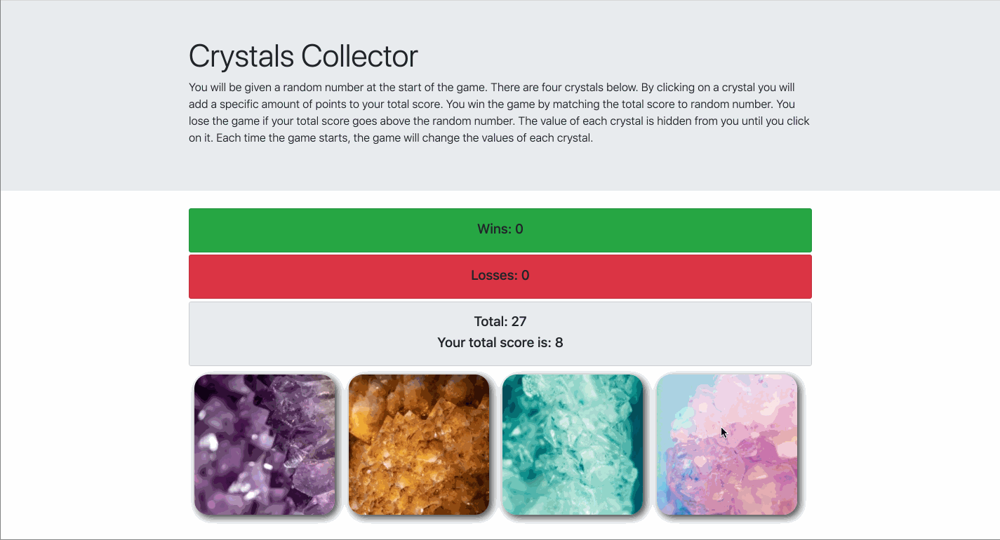
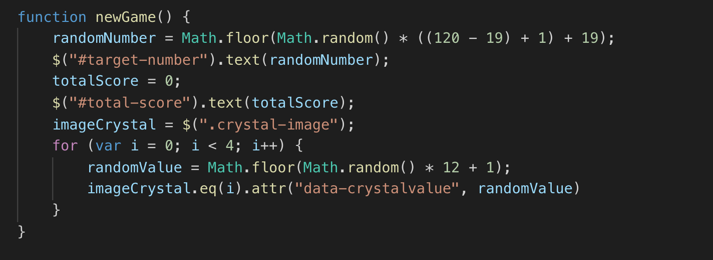
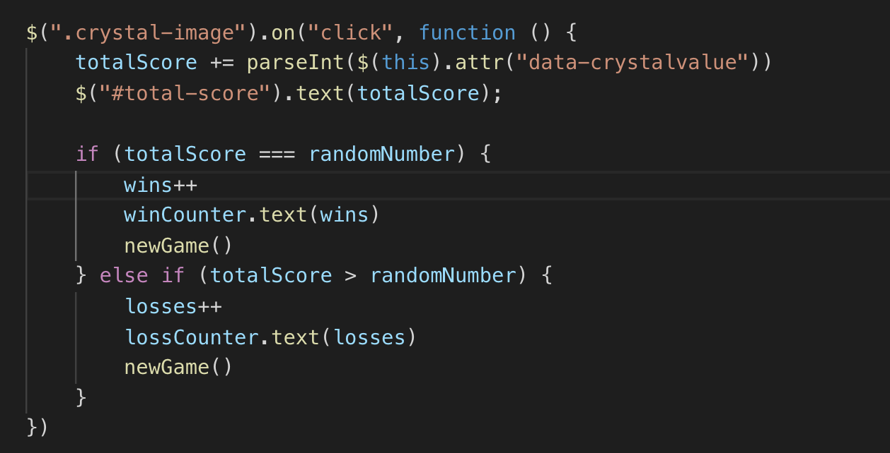

# Crystals Collector Game

## Description

In this guessing game, the player will be shown a random target number at the start of the game. When the player clicks on a crystal, it will add a specific amount of points to the player's total score. Player wins when their score matches the target number. The goal of this project was to use JQuery to create dynamic HTML elements.

## Technologies used

- JQuery
- JavaScript
- HTML5
- CSS
- Bootstrap

## GIF Walkthrough

## Essential Code

Logic to reset/start a new game:

Logic to modify counters when crystals are clicked:

